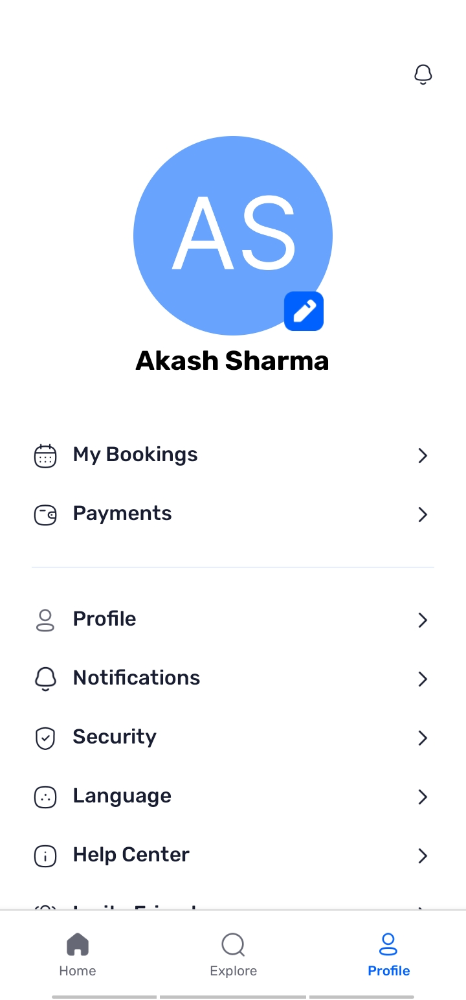

# ReState

ReState is a full-stack real estate application built with React Native, featuring Google Authentication and Appwrite for backend services. This app aims to streamline real estate management and exploration, offering an intuitive and user-friendly interface.

## Features

- **Google Authentication:** Secure and seamless login experience.
- **Real-Time Data:** Powered by Appwrite for backend services.
- **Custom Styling:** Leveraging Nativewind for modern and responsive designs.
- **Cross-Platform:** Compatible with both iOS and Android.

## Tech Stack

- **Frontend:** React Native
- **Language:** TypeScript
- **Styling:** Nativewind
- **Backend:** Appwrite

---

## Screenshots

### 📱 Logo and Authentication
<p align="center">
  
  
</p>
<p align="center">Showcasing the app's branding and seamless Google Authentication.</p>

### 🏠 Home Screen and Search
<p align="center">
  
  
</p>
<p align="center">Discover properties through the intuitive home screen and explore search functionality.</p>

### 🏡 Property Listings and Details
<p align="center">
  
  
</p>
<p align="center">Browse property listings and view detailed information for selected properties.</p>

### 📷 Profile
<p align="center">
  
</p>
<p align="center">Manage user profiles and view account details effortlessly.</p>

---

## Installation

1. Clone the repository:
   ```bash
   git clone https://github.com/yourusername/restate.git
   cd restate
   ```

2. Install dependencies:
   ```bash
   npm install
   ```

3. Configure environment variables:
   - Create a `.env` file in the root directory.
   - Add your Appwrite and Google Authentication keys.

4. Run the application:
   ```bash
   npm run android  # For Android
   npm run ios      # For iOS
   ```

## Usage

- Launch the app on your emulator or physical device.
- Login using Google Authentication.
- Explore real estate listings and manage properties.

## Folder Structure

```
.
├── app
│   └── root
│       ├── tabs        # Apps Screens
│       ├── properties  # Properties to display
│       ├── global.css  # Apps Styling
│       └── sign-in.tsx # Apps Authentication
├── assets              # Static assets (images, fonts, icons)
├── components          # Reusable UI components
├── lib                 # Appwrite logic
└── README.md           # Documentation
```

## Contributing

Contributions are welcome! Please fork this repository and submit a pull request with your changes. For major changes, open an issue first to discuss what you'd like to change.

## License

This project is licensed under the MIT License. See the [LICENSE](LICENSE) file for details.

## Acknowledgments

- [React Native](https://reactnative.dev/)
- [TypeScript](https://www.typescriptlang.org/)
- [Nativewind](https://www.nativewind.dev/)
- [Appwrite](https://appwrite.io/)
